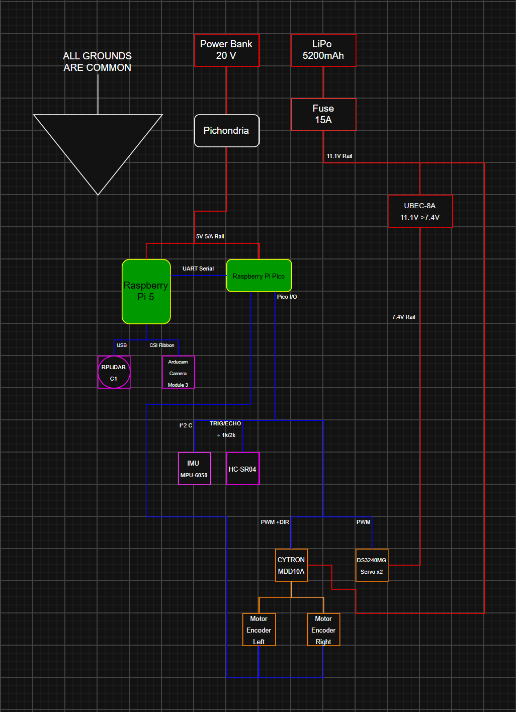

# Weedl
**An autonomous weed-pulling robot for residential backyards**

Weedl drives itself around a fenced yard, finds common backyard weeds (dandelions, first-year bull thistle, etc...), lines up with it, and mechanically uproots them.

>**Status:** In active development. The full system is designed and the compute/sensing stack is still being brought up. The robot is not yet fully assembled. See [Current Status](#current-status) for exactly what's going on.

## Why I built this
During the heat of the summer, uprooting weeds can become tedious, painful, and overall just a bad experience. 
Seeing how my dad went out and uprooted weeds nearly every day, I felt annoyed that something so easy and tedious had to be done by a person. I did some searching, just to see if our family could purchase a weed removal robot. Unfortunately, the only related robots that existed were industry/commercial grade.

Once I realized I could build my own robot that would uproot weeds for my dad, Weedl was born. I believe that autonomous robotics and AI shouldn't 
replace humans, but replace certain tasks that would other wise be a waste of time. Humans deserve to spend time doing more important things, like 
spending time with their family, and I hope Weedl can achieve this.

## What it is

Weedl is a small tracked robot that autonomously covers a backyard and removes weeds one at a time. It's built around two ideas:

1. **See and navigate like a real autonomous robot** Weedl builds a live map of the yard with a LiDAR, knows where it is within that map, plans a coverage path, and avoids obstacles, using software such as ROS2, SLAM, Nav2, and more!

2. **Uproot mechanically, not chemically** Instead of spraying chemicals into the same garden where fruits and vegetables are grown, Weedl uses a double pivot fork to dig into the roots of a weed and lever it out.

## Journaling/Devlogs

I made this project with Hack Club Stardance. You can look at this project [here](https://stardance.hackclub.com/projects/14197).

---
## How it works

### The Compute pair (Pi + Pico)

Weedl splits its computing across two processors on purpose:

**Raspberry Pi 5** runs the high-level autonomous under **ROS2 Jazzy**: SLAM, mapping, navigation, sensor fusion, weed detection, and the behavior logic. The pi acts as the brain.

**Raspberry Pi Pico** handles the realtime work: motor PID control, wheel encoder processing, servo timing, and an **independent safety watch dog**. Because it's separate from the Pi, it can cut the motors if the Pi ever fails.

The two talk over a **UART serial link**

### Sensing
**RPLiDAR C1** is connected to the Pi. It will be used to create a 2D 360 degree scan around the robot to detect obstacles and create a map.

**Arducam Camera Module 3 (IMX708)** is connected to the Pi. It's the most important sensor for weed detection. A lightweight model spots weeds and locates them on the ground.

**MPU-6050 IMU** used for orientation and motion sensing, fused with wheel odometry for a stable position estimate.

**HC-SR04 ultrasonic** used for low obstacle detection beneath the LiDAR's scan plane.

### Moving

A **tracked (tank style) chassis** with two encoder motors, is driven by a **Cytron MDD10A** dual-channel motor driver. Tracks let Weedl turn in place while maintaining grip on the ground.

### Uprooting

A **double-pivot fork** with chisel-ground tines, each pivot driven by a single **40 kg·cm DS3240MG servo**. A hood/fulcrum behind the tines acts as both a depth stop and a prying point. To insert, the fork drives into the soil beside the weed's root crown while the pivot servo adds a small, fast back-and-forth oscillation. This lets the tines work into firm soil using far less force than a straight push would need. Once inserted, the arm levers back against the hood, using it as a fulcrum to pop the root out rather than relying on the robot's own weight to hold it down.

### Power/Wiring
Weedl runs off a single 3S LiPo battery, split into three isolated voltage rails so a motor or servo current spike can't brown out the compute stack: **11.1V** straight to the drive motors, **7.4V** through a UBEC for the servos, and a regulated **5V** through a buck converter for the Pi and Pico. Everything shares a common ground, and the HC-SR04's ECHO line runs through a 1kΩ/2kΩ voltage divider to protect the Pico's 3.3V GPIO from the sensor's 5V signal.

## Software / autonomy stack

Running on the Pi under **ROS 2 Jazzy** (Ubuntu Server 24.04):

**slam_toolbox** - builds and maintains the map of the yard from LiDAR scans.

**Nav2** - pathplanning and obstacle avoidance

**robot_localization (EKF)** - fuses IMU and wheel odometry into a smooth position estimate.

**Weed detection** - a lightweight **TFLite** model runs directly on the Pi 5's CPU.

**Behavior state machine** — the core loop: `SEARCH → APPROACH → ALIGN → INSERT → PRY → RELEASE → RESUME`.
